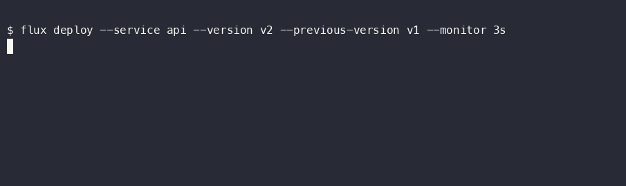
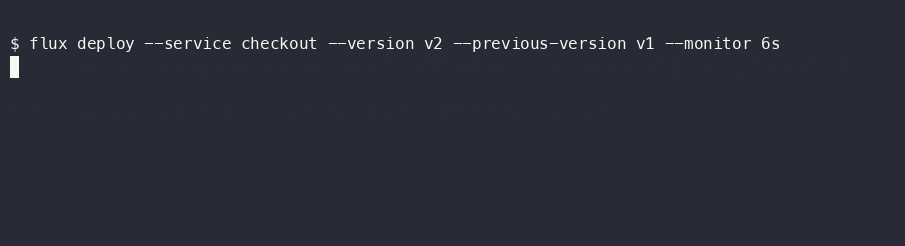

> [!NOTE]
> A learning project. I built it to go deep on Effect v4 and Temporal, not to run in production.

# flux

A canary deployment tool. It moves traffic to a new version a step at a time,
watches error rate and latency, and rolls back if they get worse. The
orchestration is a Temporal workflow, so a crash or a long monitoring window
doesn't lose it. It drives nginx or Caddy and reads Prometheus.

[](https://effect.website/)
[](https://temporal.io/)



Same command, a version whose error rate is 8× its budget. The breach is caught
in the first window, so only 10% of traffic ever saw it:



Both are real recordings against a running stack, reading real Prometheus
metrics. `api` is genuinely healthy and `checkout` genuinely is not.

## How a deployment runs

You give it a service, the new version, and the one to fall back to. The workflow
health-checks the new version, shifts 10% of traffic, watches the metrics for a
while, then 50%, then 100%. If a metric crosses its budget it rolls back. A step
can pause for a manual approval.

The constraint I cared about is the split between Temporal and Effect:

- The **workflow** is plain deterministic TypeScript. No Effect, no I/O, no
  `Date.now()`. Temporal replays it, so it has to stay pure.
- The **activities** are where Effect runs, on one runtime per worker. They probe
  the URL, rewrite the nginx config, query Prometheus. Each one validates its
  input with a Schema and turns typed failures into Temporal failures so the
  reason survives the wire.

Rollback is a saga. The first traffic shift registers a compensation that puts
the previous version back at 100%, and any ending that isn't a success runs it.
A rollback then verifies itself: it re-checks the previous version is actually
healthy again, and if the compensation couldn't restore traffic or that version
stays down, the deployment ends in a louder `RollbackFailed` rather than
pretending it recovered.

```
  flux deploy --service api --version v2
        │
        ▼
  ┌─────────────────────────────────┐            ┌───────────────────────────┐
  │ Temporal   (durable, no Effect) │            │ worker   (Effect runtime) │
  │ deploymentWorkflow              │            │                           │
  │                                 │            │ activities:               │
  │  1. health check                │  ───────►  │   health   (local)        │
  │  2. shift 10%                   │            │   router   (nginx reload) │
  │  3. monitor (heartbeat)         │            │   metrics  (Prometheus)   │
  │  4. breach?  -> roll back       │            │   notify   (Slack)        │
  │  5. approve gate (update)       │            └───────────────────────────┘
  │  6. -> Succeeded                │
  └─────────────────────────────────┘
```

## Some things I wanted to try

Choices that go past plumbing:

- Two threshold rules that share a PromQL query hit Prometheus once per poll, not
  twice, through a `RequestResolver`. The metrics port has a second backend for
  apps without Prometheus: a generic HTTP-JSON adapter that reads a value at a
  JSON path (`"<url> <path>"`), with the same one-fetch-per-shared-query dedup, so
  the query stays an opaque string the adapter interprets, so nothing above the
  port changed.
- A rule can admit that it does not know yet. A threshold comparison needs a
  large sample to mean anything, and a canary over a workload that produces tens
  of observations rather than thousands quietly stops having one: 1 failure in
  30 reads as 3.3%, and against a 5% limit the plain rule says promote. The true
  rate consistent with that sample runs from 0.6% to 16.7%, so the reading is
  equally compatible with a version far better than the limit and one three
  times worse. The worst case looks best: zero failures in 20 observations still
  spans up to 16%, and a threshold calls it perfect. So a rule may declare
  `sampleSize`, the PromQL for its denominator, and its rate is then compared
  through a Wilson interval with three possible answers rather than two. An
  undecided window is extended up to `maxMonitorMs` rather than resolved by
  guesswork, and a budget spent without an answer rolls back, because leaving
  traffic on a version nothing could vouch for is the one option that is not a
  decision.

  ```json
  {
    "service": "coding-agent", "version": "v2", "previousVersion": "v1",
    "strategy": { "kind": "canary", "steps": [{ "percent": 10, "monitorMs": 3600000, "requiresApproval": false }] },
    "rules": [{
      "name": "taskFailureRate",
      "query": "sum(rate(agent_task_failures_total{version=\"v2\"}[1h])) / sum(rate(agent_tasks_total{version=\"v2\"}[1h]))",
      "sampleSize": "sum(increase(agent_tasks_total{version=\"v2\"}[1h]))",
      "max": 0.05
    }],
    "maxMonitorMs": 86400000,
    "pollIntervalMs": 60000
  }
  ```

  Leave `sampleSize` out and the comparison is exactly what it always was, which
  is the right thing for a metric backed by thousands of requests. The interval
  is only meaningful for a proportion, so a value outside `[0, 1]` falls back to
  the plain comparison however the rule was written: a p99 latency handed a
  sample size is a mistake, and inventing an interval for it would make that
  mistake confident instead of merely wrong.

- A rule can also be judged on verdicts that arrive later. Whether a unit of
  work succeeded is often settled well after it was routed: the pull request
  merges, the suite goes green, a reviewer accepts it. There is no gauge to
  scrape at the moment of the decision, so `outcomeRule` is fed by
  `POST /deployments/{id}/outcomes` instead, which lands as a Temporal signal on
  the running deployment. A signal rather than an update, deliberately: Temporal
  accepts one whether or not a worker is up and delivers it when one returns,
  while an update needs a live worker. A verdict lost because the workers
  happened to be mid-redeploy would bias the sample silently, and in the healthy
  direction. The tally rides through `continueAsNew`, so a deployment that
  bounds its own history does not discard the evidence it has spent days
  gathering, and it goes through the same interval as a scraped rate: zero
  verdicts is `Inconclusive`, not a tidy 0% failure rate.

- Admission control (one deployment per service, plus a global cap) is a single
  STM transaction: a `TxSemaphore` and a `TxHashMap` updated together, so two
  concurrent triggers can't over-admit.
- A rollback outranks new work. The compensation that restores the previous
  version is scheduled at the top task-queue priority, so when several
  deployments share a worker and one goes bad, getting users off the bad version
  jumps ahead of the others' traffic shifts. A test reads it back off the
  recorded history.
- `status --watch` streams live state over a websocket, fed by a `PubSub` a poller
  writes to.
- `/stats` answers questions Temporal's visibility can't (rollback rate per
  service, mean canary duration) from a small SQLite read model.
- A multi-service rollout is a parent workflow over one child per service, and it
  deploys them in dependency order. You declare what needs what; the control
  plane compiles that into a topological plan with Effect's `Graph` and hands the
  workflow flat lookup tables, so the graph never enters the deterministic side
  and the order is frozen in history rather than recomputed at replay. `--plan`
  resolves it without deploying anything:

  ```
  $ flux deploy-multi --config rollout.json --plan
  [flux] rollout order for 4 services:
    1. db
    2. api, cache
    3. web

  $ flux deploy-multi --config broken.json --plan
  [flux] dependency cycle: web -> db -> api -> web
  ```

  `api` and `cache` both wait on `db` and then go together; `web` waits for both.
  A cycle is refused before anything starts and says which one it found, which is
  the reason to reach for a graph library rather than hand-roll the sort. Failure
  is a policy too: `abort-dependents` stops only what transitively depends on the
  service that broke, lets independent branches finish, and reports the blocked
  ones `Skipped` rather than failed, because no child ever ran for them.
- The rollout shape is a strategy the workflow is polymorphic over. Canary shifts
  traffic in steps; blue/green flips 100% at once after a health check and bakes,
  rolling back with a single shift because the old version was never scaled down.
  Same activities, same ports, same saga, and only the workflow's branch differs.
  Adding it needed no `workflow.patched()`: the branch is chosen by the input, so
  histories recorded before it still take the identical canary path.
- An abort cancels the in-flight monitor immediately (a `CancellationScope`)
  instead of waiting out the window.
- The router port has two deliberately opposite implementations. nginx renders
  a file and reloads a process behind a lock; Caddy PATCHes its admin API,
  stateless and lock-free, and the same canary passes through both without a
  line changing above the port.
- Payloads above 1 KiB are gzipped on the wire and in Temporal's history by a
  codec that never enters the workflow VM; a `/codec` endpoint lets the
  Temporal UI read them back. The integration test asserts the stored history
  payload really is `binary/gzip`.
- A deployment is one trace, not two. Client and activity interceptors carry a
  W3C `traceparent` through Temporal's own headers. The workflow has to forward
  it to every activity it schedules itself; Temporal doesn't do that for you.
  This replaced an earlier version that faked a trace root from the workflow's
  run id. Proven the same way as the codec: the raw history shows the same
  header on the start event and the first activity's scheduled event.
- A separate experiment reimplements the same canary (same domain types, same
  activities) on Effect's own `effect/unstable/workflow` instead of Temporal.
  It lives in `packages/comparison`, is never imported by the running app, and
  its durability is proven the blunt way: a test SIGKILLs the process
  mid-monitor and a fresh process resumes the canary from the same SQLite file,
  replaying completed steps instead of redoing them. The full write-up of what
  each engine buys is in [docs/comparison.md](docs/comparison.md).
- A deploy can be fenced to a time window: `flux deploy --window "* 9-17 * * 1-5"`
  refuses to start outside weekday business hours and tells you when the window
  next opens. The window is a cron expression evaluated by a pure domain
  function before admission; it never reaches the workflow. (Building it caught
  that Effect's `Cron` is second-precise, so a range window needs the clock
  floored to the minute.)
- The workflow's code has evolved a few times the way it would in production:
  new activity calls added behind `workflow.patched()`. The committed replay
  histories prove both directions: old histories replay the old path, and the
  same edit without the patch guard fails the replay test with a determinism
  error. The lock also refuses `deprecatePatch` while those histories exist,
  which is the patch lifecycle doing its job. That's the manual way to change a
  running workflow;
- A rollback drafts its own postmortem. When a canary rolls back, an activity
  asks a language model which metric regressed and why, through Effect's own
  provider-agnostic `LanguageModel` port. The use case never names a provider;
  the Anthropic one is a small adapter in the same shape as the Slack one. To
  keep it from just paraphrasing metrics the operator already sees, it's fed the
  commits shipped between the two versions (a changelog port over GitHub's
  compare API), so the model correlates the actual change with the symptom
  instead of guessing. It's best-effort throughout: no key means no network call
  and the rollback is untouched, and a missing changelog degrades to a
  metrics-only summary. Scheduling it on the rollback path changed the command
  sequence, so it too went behind `workflow.patched()`, which the committed
  rollback history caught the moment it wasn't. A local HTTP double proves the
  commit and the breach facts both reach the prompt.

## Layout

A pnpm + Turborepo monorepo.

| Package | Role |
|---|---|
| `@flux/domain` | Schemas, tagged errors, pure rules |
| `@flux/application` | Use cases and the four ports: metrics, router, health, notify |
| `@flux/adapters` | Port implementations: Prometheus, nginx, Caddy, HTTP health, Slack |
| `@flux/orchestration` | Temporal workflows and activities |
| `@flux/comparison` | The same canary on Effect's own workflow engine, an experiment, not shipped |
| `@flux/contracts` | Shared HTTP + RPC schemas, so the CLI and control plane agree |
| `@flux/config` | TOML + env configuration |
| `apps/worker` | Runs the Temporal worker |
| `apps/control-plane` | HTTP API, websocket watch, SQLite read model |
| `apps/cli` | `flux`: deploy, deploy-multi, drift, status, stats, approve, abort, history |

## Kubernetes

flux does not require Kubernetes and does not use its primitives to shift
traffic. It can also be deployed *onto* Kubernetes with the chart in
[`deploy/kubernetes`](deploy/kubernetes), which exists as a laboratory rather
than as a distribution: the question it answers is how a durable deployment
system behaves when the orchestrator running it can evict its processes.

A canary runs entirely in-cluster there, and the experiment that justifies one
is `apps/worker/test/kubernetes.test.ts`: delete the worker pod mid-monitor and
the canary still completes. The recovery is not the heartbeat timeout the SIGKILL test provokes:
a draining worker hands its activity task back to the queue and it is
redelivered, with no failure recorded, which is faster.

The cluster's other use is breaking things underneath flux and watching what it
does. Prometheus blackholed mid-monitor turns out not to look like a breach, so
a metrics outage does not roll a healthy version back; it did reveal that a hung
dependency is invisible to an activity heartbeat, which is a concurrent daemon
proving the process alive rather than the work progressing. Temporal scaled to
zero takes the control plane out of the Service without restarting it, which is
what the liveness and readiness split is for, and that is only observable from
outside. Evicting a worker through the eviction API is refused by the disruption
budget while a canary is running, and accepted once a replacement is ready.

flux needs no RBAC rules to do any of it: it never touches the Kubernetes API.
The same claim from the kernel's side is in the chart, which runs both
deployments as uid 1000, drops every capability, and gives them a read-only root
filesystem.

## Running it

Node ≥ 22, pnpm 11. The backing services run in Docker. The `demo` profile is
not optional for a canary that actually completes: it brings the target the
health check calls, the Caddy the traffic shifts go through, and the exporter
whose numbers the thresholds read.

```bash
docker compose --profile demo up -d --wait \
  postgresql temporal prometheus jaeger caddy demo-target demo-metrics temporal-ui
docker compose run --rm temporal-namespace    # one-shot: it exits, so not `up`
pnpm install
pnpm typecheck && pnpm test
```

Then, in separate terminals:

```bash
# The worker's defaults address the compose network (`api-v2:8080`, an nginx
# config file), and it runs on your machine, so point it at what it can reach.
HEALTH_URL=http://localhost:8088/ \
ROUTER_TYPE=caddy ROUTER_ADMIN_URL=http://localhost:2019 ROUTER_SERVER_NAME=flux \
OTLP_ENDPOINT=http://localhost:4318 \
pnpm --filter @flux/worker dev

OTLP_ENDPOINT=http://localhost:4318 pnpm --filter @flux/control-plane dev

pnpm --filter @flux/cli dev -- deploy --service api --version v2 --previous-version v1
pnpm --filter @flux/cli dev -- status --workflow-id <id> --watch
```

`OTLP_ENDPOINT` has to be named: there is no default, because the only sensible
one (`localhost:4318`) is wrong inside every container, and a whole trace chain
was silently going nowhere in Kubernetes before that was noticed. Unset, the
trace is still propagated, just not recorded.

Add `FLUX_TRACE_CONSOLE=1` to draw each span tree in the terminal as it
finishes, with log lines under the span that emitted them. Run the worker
directly rather than through `pnpm dev`, which prefixes every line with the
package name and shreds the drawing.

Temporal UI is at :8233, Jaeger at :16686, Prometheus at :9090. Config lives in
`flux.config.toml`; environment variables override it.

## What's proven

Three tiers, because a learning project is only worth as much as what holds up.

**End to end, against a real (time-skipping) Temporal.** The canary workflow
(sequencing, saga rollback, approval gate, typed-failure → `Failed`). The control
plane's client, trigger through outcome. Multi-service fail-fast. The cancellable
monitor. `continueAsNew`. The Caddy router adapter drives a **real Caddy** over its
admin API, including a fetch through the proxy to check the config it wrote is one
Caddy serves rather than only one it stores. And, with the real adapters pointed at local HTTP
doubles, a full canary to `Succeeded` that checks the side effects actually
happened: the health endpoint got probed, the nginx config got written.
Three captured histories (a promotion, a rollback, and a dependency-ordered
rollout that loses a service in the middle) are committed and replayed against
the current workflow code on every run, so an edit that would break in-flight
deployments fails as a determinism error before it ships.

**In isolation.** Compiling the dependency graph: a cycle is named, a dependency
on a service outside the rollout is rejected, and two property tests over random
DAGs check that a dependency always lands in an earlier wave and that nothing is
ever its own dependent. The STM admission controller (five concurrent triggers, a
budget of two, exactly two admitted). Drift comparison and reconciliation. The
SQLite projection and its aggregation query. The poller's delta suppression.

**Against a real cluster, in CI.** The time-skipping server implements neither
worker versioning, nor the tuner's native config, nor Schedules, nor Nexus, so
a second CI job boots the repo's own compose and proves them for real. A
versioned worker pins the workflow it ran (the `describe` shows the deployment
and build id). A worker running the production tuner completes a canary. A
worker with autoscaling pollers (the number of open polls tracks the queue
backlog, no Kubernetes) completes one too, and the queue's backlog is read back
over the raw `DescribeTaskQueue` gRPC. The drift Schedule's create →
update-in-place → delete lifecycle holds. A second
namespace triggers a canary in a separate platform namespace through a
registered Nexus endpoint, with no other access to it, and the run completes
under the workflow id the cross-namespace call actually produced. And a worker
SIGKILLed mid-monitor loses nothing: the server notices the missed heartbeats
and a fresh worker finishes the canary, replaying the completed steps instead
of redoing them. This tier exists because running things for real kept finding
bugs the type checker was happy with.

---

*Effect is pinned to an exact release candidate (`4.0.0-rc.113`); upgrades are deliberate.
MIT licensed.*
